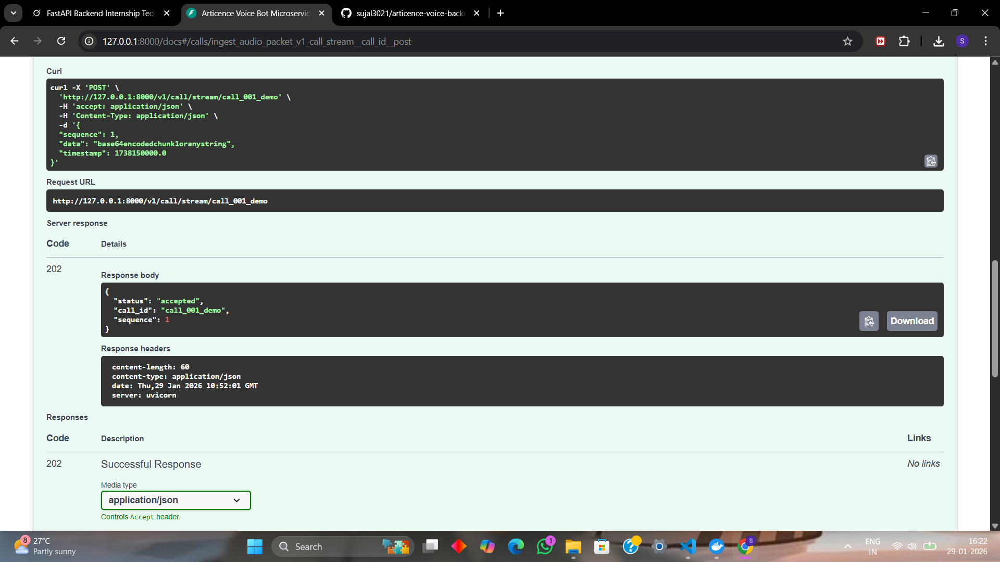
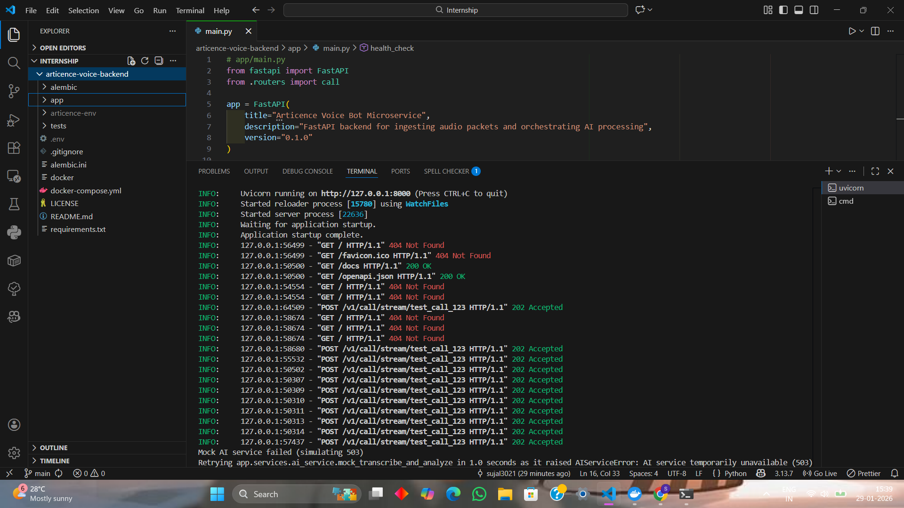

# Articence Voice & AI Backend Internship Project

FastAPI microservice that ingests concurrent simulated audio metadata packets, orchestrates background AI transcription + sentiment analysis, handles unreliable external AI APIs with retries, and stores results in PostgreSQL for supervisor dashboard.

Built for **Articence FastAPI Backend Intern** position (Voice & AI Team) — evaluation task completed January 2026.

<p align="center">
  
  
  
  
</p>

## Methodology

The approach follows the task requirements closely:

1. **Non-blocking ingestion** — Single async POST endpoint accepts packets and returns 202 Accepted immediately (<50 ms response time).
2. **Sequence validation** — Checks for out-of-order, missing or duplicate packets but **never blocks** the response — only logs warnings.
3. **State machine** — Call progresses through states (`IN_PROGRESS → PROCESSING_AI → COMPLETED / FAILED`) stored in PostgreSQL.
4. **Background AI orchestration** — When enough packets arrive (demo threshold: 10), a background task triggers transcription + sentiment analysis.
5. **Handling flaky AI** — Mock external service simulates 25% failure rate and 1–3s latency. **Tenacity** library implements exponential backoff retries (up to 5 attempts).
6. **Persistence** — All state changes and final results (transcription + sentiment) saved in PostgreSQL using async SQLAlchemy.

This design ensures high throughput, reliability despite flaky services, and clean separation of concerns.

## Technical Details

- **Framework**: FastAPI (async-first) + Uvicorn
- **Database**: PostgreSQL + SQLAlchemy 2.0 (async engine) + asyncpg driver
- **State management**: Enum-based state machine in `Call` model (`IN_PROGRESS`, `PROCESSING_AI`, `COMPLETED`, `FAILED`)
- **Retry strategy**: Tenacity library — 5 attempts, exponential backoff (1s → 2s → 4s → 8s → 10s max)
- **Background processing**: FastAPI `BackgroundTasks` — non-blocking AI execution
- **Migrations**: Alembic (async support via `-t async` template)
- **Local dev**: Docker Compose for PostgreSQL
- **Packet collection**: Dummy in-memory for demo (easy to replace with Redis or DB JSONB column)
- **Trigger condition**: Fixed packet count (≥10) — production would use timeout or explicit `/complete` signal

## Setup Instructions

1. **Clone the repository**

   ```bash
   git clone https://github.com/sujal3021/articence-voice-backend.git       
   cd articence-voice-backend

2. **Create and activate virtual environment**

   ```bash
   python -m venv articence-env
   articence-env\Scripts\activate

3. **Install dependencies**
 
   ```bash
    pip install -r requirements.txt

4. **Start PostgreSQL (Docker)**
 
   ```bash
    docker compose up -d

5. **Apply database migrations**
 
   ```bash
    alembic upgrade head

6. **Run the server**
 
   ```bash
    uvicorn app.main:app --reload --port 8000

7. **Open interactive documentation**
 
   ```bash
    http://127.0.0.1:8000/docs
    

##Quick Test Example

Send packets to trigger AI processing:
 
   ```bash
   curl -X POST "http://127.0.0.1:8000/v1/call/stream/test_call_123" ^
   -H "Content-Type: application/json" ^
   -d "{\"sequence\":1,\"data\":\"chunk1\",\"timestamp\":1738150000.0}"
   ```


Repeat 10+ times (increase sequence) → watch logs for AI task → then check DB:

  ```bash
  docker compose exec -it postgres psql -U postgres -d articence_db -c "SELECT * FROM calls;"
  ```

##Submission Note

This repository implements all required aspects of the FastAPI Backend Intern task.

Thank you for reviewing!
Sujal Saha
January 29, 2026


## Screenshots

### Swagger API Docs


### API Request Example


### Terminal



